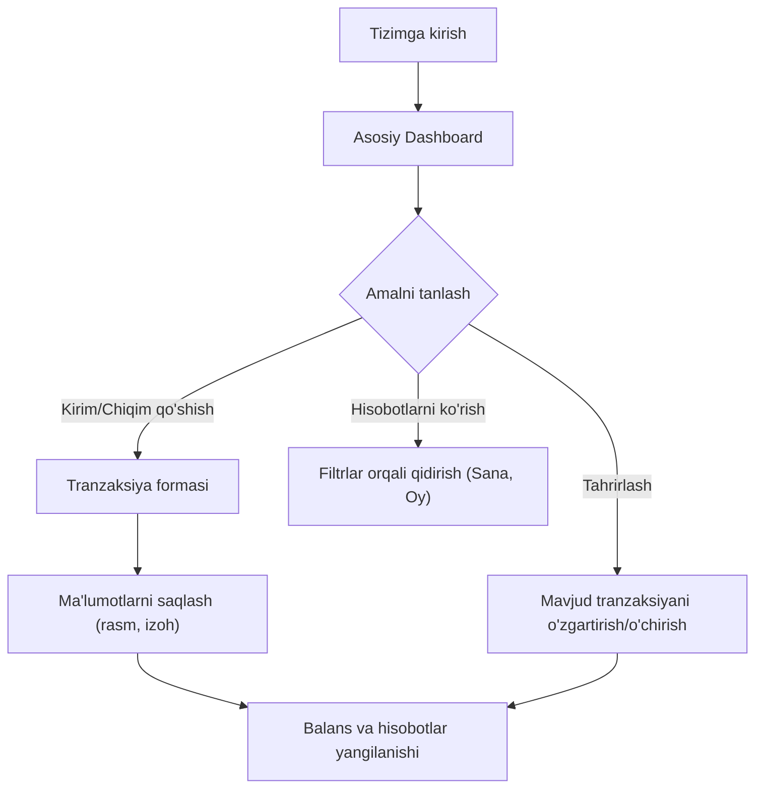

## 1. Mahsulot haqida qisqacha ma'lumot
Ushbu loyiha shaxsiy yoki biznes moliya hisob-kitoblarini yuritish uchun mo'ljallangan to'liq ishlaydigan veb-sayt.
- **Maqsad**: Foydalanuvchilarga o'zlarining barcha kirim va chiqimlarini hisobga olish, tahlil qilish hamda mablag'larni boshqarish imkonini berish.
- **Qimmat**: Moliyaviy intizomni oshirish, kunlik/oylik/yillik xarajatlarni kuzatish orqali byudjetni samarali taqsimlash.

## 2. Asosiy Xususiyatlar

### 2.1 Foydalanuvchi Rollari
| Rol | Ro'yxatdan o'tish usuli | Asosiy ruxsatlar |
|------|---------------------|------------------|
| Oddiy foydalanuvchi | Email yoki foydalanuvchi nomi orqali | O'z hisob-kitoblarini kiritish, tahrirlash, tahlillarni ko'rish |

### 2.2 Xususiyatlar Moduli
1. **Asosiy sahifa (Dashboard)**: Umumiy balans, kunlik/haftalik/oylik/yillik hisobotlar grafiklari.
2. **Tranzaksiyalar sahifasi**: Kirim va chiqimlar ro'yxati, filtrlash (sana, yil, oy, kategoriya bo'yicha).
3. **Kirim/Chiqim qo'shish moduli**: Mablag' turini (Naqt, karta), kategoriyani, sanani, izohni va chek rasmini kiritish.
4. **Hisoblar (Accounts) va Kategoriyalar (Categories) boshqaruvi**: Naqt pul, karta yoki yangi hisob turlarini yaratish va tahrirlash. Kategoriyalarni (Transport, Kafe va hk) boshqarish.

### 2.3 Sahifalar Tafsiloti
| Sahifa nomi | Modul nomi | Xususiyat tavsifi |
|-----------|-------------|---------------------|
| Asosiy sahifa | Boshqaruv paneli | Jami balans, so'nggi tranzaksiyalar, davr bo'yicha daromad/xarajat statistikasi. |
| Tranzaksiyalar | Ro'yxat va Filtrlar | Barcha kirim/chiqimlarni ko'rish, o'zgartirish, o'chirish. |
| Tranzaksiya qo'shish | Forma | Summa, sana, izoh, kategoriya, hisob turi, va rasm (chek) yuklash. |

## 3. Asosiy Jarayon
Foydalanuvchi tizimga kiradi, o'zining jami balansini va oxirgi harakatlarini ko'radi. U yangi chiqim (masalan, Transport) yoki kirim qo'shishi mumkin. Forma orqali mablag' qaysi hisobdan ketgani (Karta/Naqt) va chek rasmini yuklaydi. Saqlangach, jami summa avtomatik yangilanadi va grafiklar o'zgaradi. Zarurat bo'lsa, xatoni to'g'rilash uchun tahrirlash tugmasi orqali hisob turini yoki summani o'zgartiradi.

## 4. Foydalanuvchi Interfeysi Dizayni
### 4.1 Dizayn Stili
- **Ranglar**: Ishonchni uyg'otuvchi to'q ko'k va oq (Professional moliyaviy stil), kirimlar uchun yashil, chiqimlar uchun qizil urg'ular.
- **Tugmalar uslubi**: Silliq qirrali (rounded-lg), zamonaviy hover effektlari.
- **Shrift**: Inter yoki Roboto (toza, o'qishli).
- **Layout uslubi**: Dashboard tipidagi yon navigatsiya (Sidebar) va ma'lumotlar kartochkalari (Cards).
- **Ikonkalar**: Lucide-react yoki shunga o'xshash professional ikonka to'plami.

### 4.2 Sahifa Dizayni Sharhi
| Sahifa nomi | Modul nomi | UI Elementlari |
|-----------|-------------|-------------|
| Boshqaruv | Statistika | Katta raqamlarda jami summa, yashil/qizil progress barlar, chiziqli grafiklar. |
| Tranzaksiyalar| Jadval/Ro'yxat | Qatorlarda rasm (chek) kichik ko'rinishi, kategoriya ikonkalari, tahrirlash/o'chirish tugmalari. |

### 4.3 Moslashuvchanlik
Ish stoli (Desktop) uchun optimallashtirilgan, lekin mobil qurilmalarda ham jadvallar scroll qilinadigan yoki kartochka shakliga o'tadigan (Mobile-responsive) qilib yasaladi.
