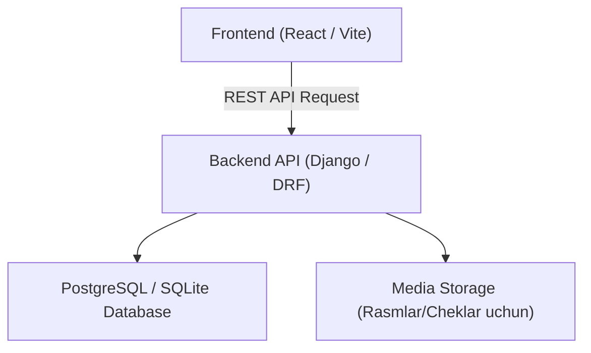
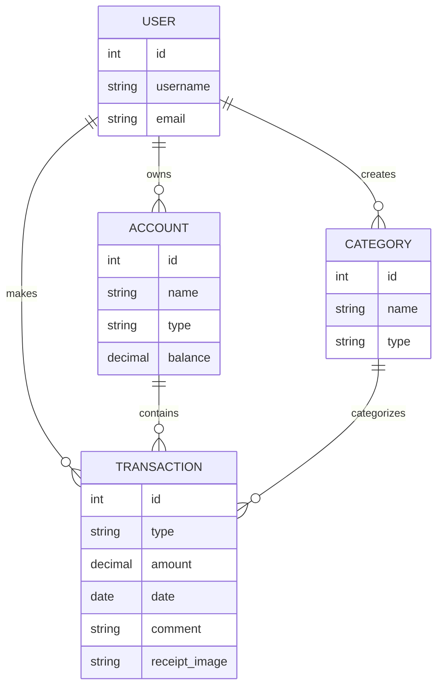

## 1. Arxitektura Dizayni
Ushbu loyiha zamonaviy Full-stack arxitekturasida (Django Backend + React Frontend) yoki to'liq Django (Template) tizimida yaratilishi mumkin, lekin interfeysning professionalligini ta'minlash uchun **React + Django API** yoki kuchli **Django Templates + TailwindCSS** yondashuvi qo'llaniladi.

## 2. Texnologiyalar Tavsifi
- **Frontend**: React@18 + TailwindCSS + Vite (Zamonaviy va tezkor UI uchun)
- **Backend**: Django 5 + Django REST Framework
- **Ma'lumotlar bazasi**: SQLite (boshlang'ich) yoki PostgreSQL
- **Rasm yuklash**: Django Media storages

## 3. Marshrutlar (Routes) va API Ta'riflari
| Route (API) | Maqsad |
|-------|---------|
| `/api/auth/` | Foydalanuvchi avtorizatsiyasi (Login, Register) |
| `/api/transactions/` | Barcha kirim/chiqimlarni olish, yangi qo'shish |
| `/api/transactions/<id>/` | Tranzaksiyani tahrirlash yoki o'chirish |
| `/api/accounts/` | Hisob turlarini (Naqt, Karta) olish va boshqarish |
| `/api/categories/` | Kirim va chiqim kategoriyalarini boshqarish |
| `/api/statistics/` | Kunlik, haftalik, oylik va jami hisobotlarni olish |

## 4. Server Arxitekturasi (Django App'lar va Modellar)

Loyihani to'g'ri tashkil etish uchun Django'da asosan quyidagi App'lar (ilovalar) va Modellar ishlatiladi:

### 1. `users` app
Foydalanuvchilarni boshqarish uchun.
- **Model**: `User` (Django'ning standart AbstractUser modeli).

### 2. `finances` app (yoki `accounts` va `transactions`)
Barcha moliyaviy amallarni boshqarish uchun yagona katta app yoki ikkiga bo'lingan app.

#### Kerakli Modellar:

**1. `Account` modeli (Hisoblar)**
Foydalanuvchining pullari saqlanadigan joy (Naqt pul, Bank kartasi, Hamyon).
- `user`: ForeignKey (User)
- `name`: CharField (Masalan: "Asosiy karta", "Naqt pul")
- `type`: CharField (Choices: Karta, Naqt, Elektron hamyon)
- `balance`: DecimalField (Joriy qoldiq)

**2. `Category` modeli (Kategoriyalar)**
Tranzaksiyalar qaysi yo'nalishda ekanligini bildiradi.
- `user`: ForeignKey (User)
- `name`: CharField (Masalan: "Transport", "Kafe", "Oylik maosh")
- `type`: CharField (Choices: Kirim, Chiqim)

**3. `Transaction` modeli (Kirim va Chiqimlar)**
Har bir moliyaviy harakatni saqlaydi.
- `user`: ForeignKey (User)
- `account`: ForeignKey (Account) - qaysi hisobdan ketgani/tushgani
- `category`: ForeignKey (Category) - qaysi kategoriyaga oid
- `type`: CharField (Choices: Kirim, Chiqim)
- `amount`: DecimalField (Summa)
- `date`: DateField (Tranzaksiya sanasi)
- `comment`: TextField (Izoh, majburiy emas)
- `receipt_image`: ImageField (Chek rasmi, majburiy emas)
- `created_at`: DateTimeField (Tizimga kiritilgan aniq vaqt)

## 5. Ma'lumotlar Modeli (ER Diagramma)

